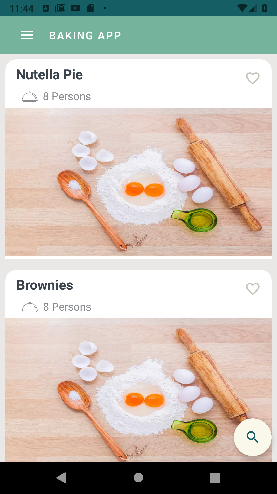
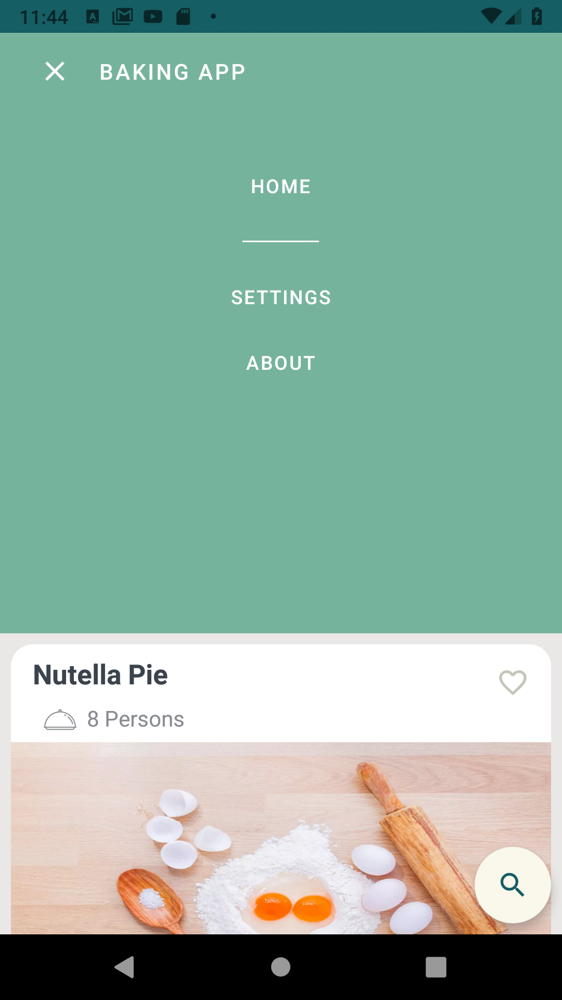
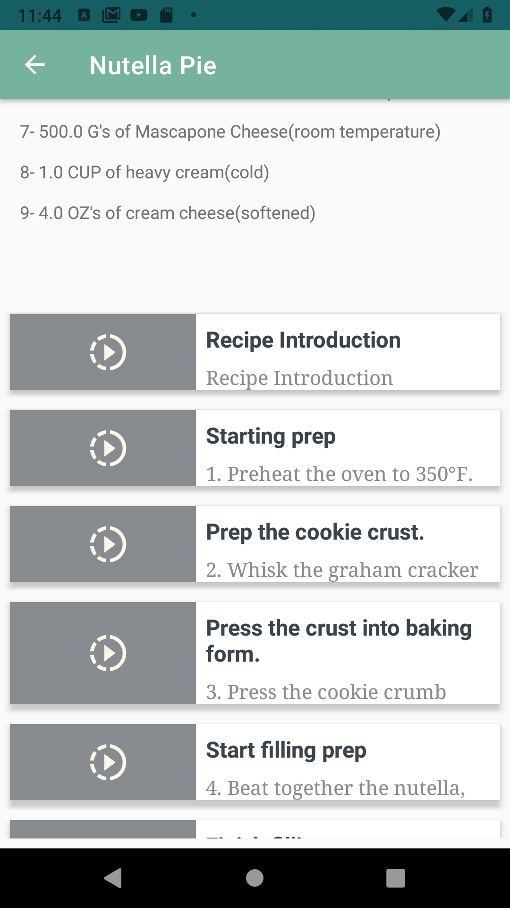
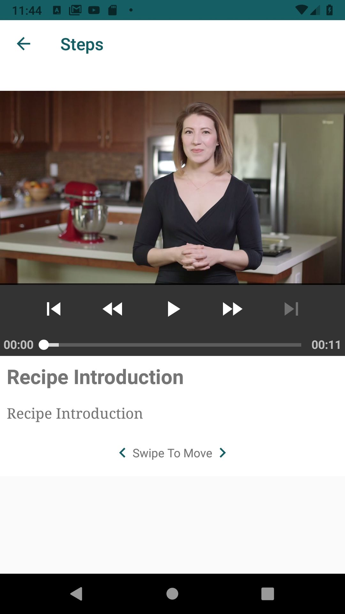
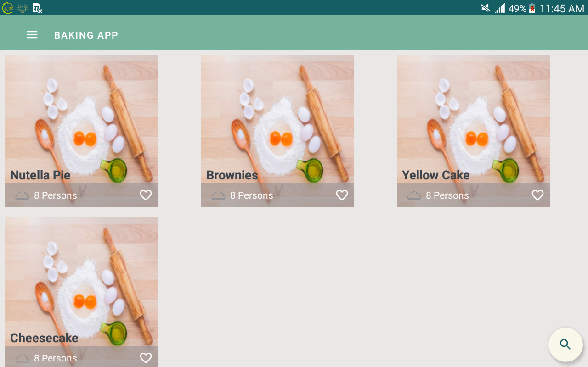
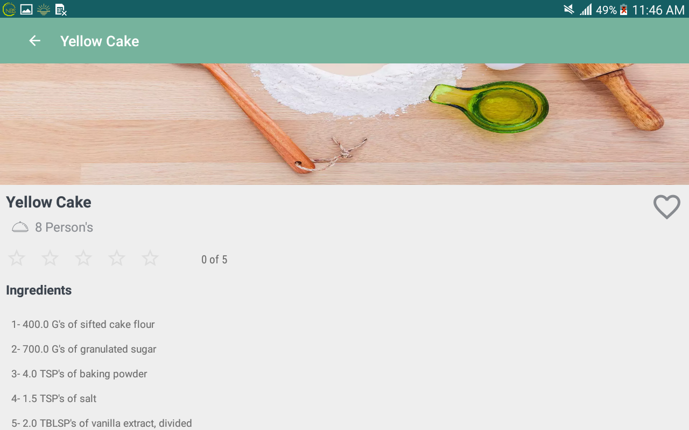
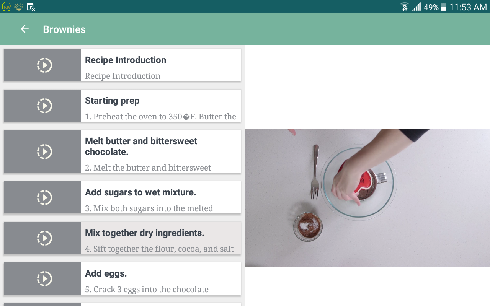
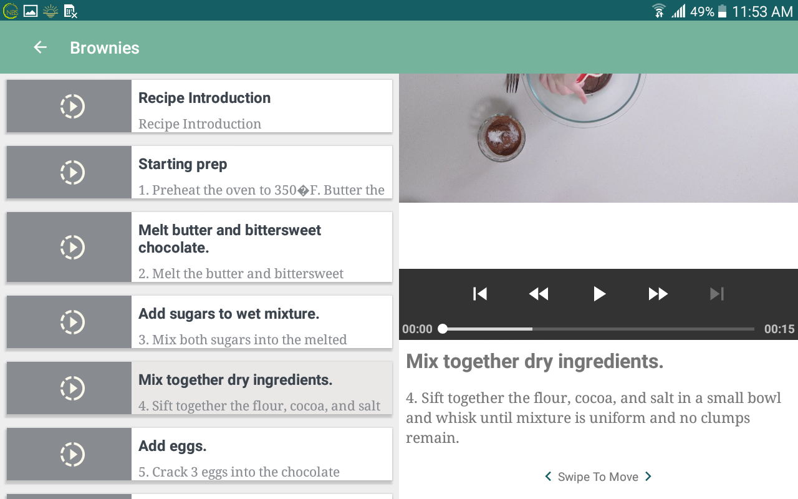
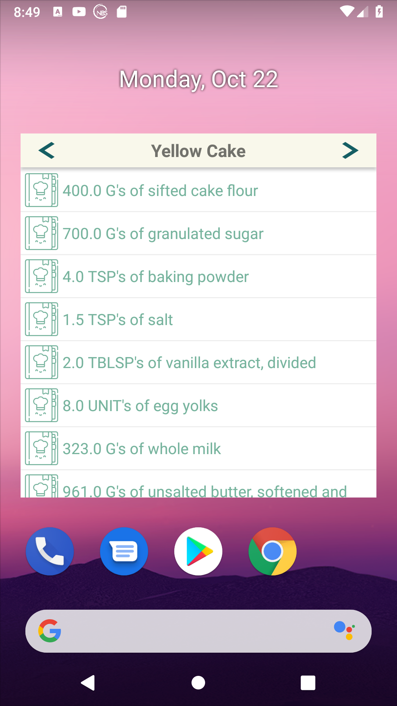

# Baking App

## Project Overview

You will productionize an app, taking it from a functional state to a production-ready state. This will involve finding and handling error cases, adding accessibility features, allowing for localization, adding a widget, and adding a library.

## Why this Project?

As a working Android developer, you often have to create and implement apps where you are responsible for designing and planning the steps you need to take to create a production-ready app. Unlike Popular Movies where we gave you an implementation guide, it will be up to you to figure things out for the Baking App.
What Will I Learn?

In this project you will:

    Use MediaPlayer/Exoplayer to display videos.
    Handle error cases in Android.
    Add a widget to your app experience.
    Leverage a third-party library in your app.
    Use Fragments to create a responsive design that works on phones and tablets.

## App Description

Your task is to create a Android Baking App that will allow Udacity’s resident baker-in-chief, Miriam, to share her recipes with the world. You will create an app that will allow a user to select a recipe and see video-guided steps for how to complete it.

The recipe listing is located here: http://go.udacity.com/android-baking-app-json

The JSON file contains the recipes' instructions, ingredients, videos and images you will need to complete this project. Don’t assume that all steps of the recipe have a video. Some may have a video, an image, or no visual media at all.

One of the skills you will demonstrate in this project is how to handle unexpected input in your data -- professional developers often cannot expect polished JSON data when building an app.

## Screenshots

### Phone View

**Main Activity Listing all the recipes**  
  

**Main Activity showing the menu**  
 

**Recipe Detail Activity displaying the recipe details**  
 

**Recipe step detail Activity**  
 

### Tablet View

**Main Activity displaying a grid list of the recipes**  
  

**Recipe Detail Activity displaying the recipe details**  
 

**MasterDetail View: Recipe Detail and steps, displaying the video and step description**  
 

**MasterDetail View: Recipe Detail and steps, displaying the video and step description**  
 

**App home Screen Widget displaying recipe name with a list of ingredients**  
  